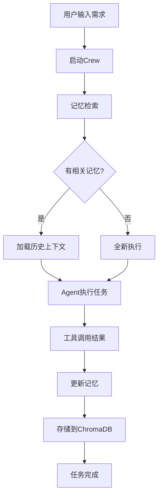

# CrewAI 记忆系统使用指南

**配置时间**: 2025-12-13  
**CrewAI版本**: 1.7.0  
**状态**: ✅ 已启用 (使用DashScope text-embedding-v3)

---

## ✅ 成功配置 - OpenAI兼容模式

**关键发现**: DashScope完全兼容OpenAI Embedding API规范!

### 配置方案

```python
crew = Crew(
    agents=[...],
    tasks=[...],
    memory=True,
    embedder={
        "provider": "openai",  # 使用openai provider!
        "config": {
            "model": "text-embedding-v3",  # DashScope模型
            "api_key": os.getenv('QWEN_API_KEY'),
            "base_url": "https://dashscope.aliyuncs.com/compatible-mode/v1",
            "dimensions": 1024  # v3支持自定义维度
        }
    }
)
```

### 为什么可以工作?

1. **DashScope官方支持**: 阿里云百炼的Embedding模型完全兼容OpenAI接口规范
2. **只需3个参数**: `base_url` + `api_key` + `model`
3. **CrewAI原生openai provider**: 无需自定义类

### 参考文档

- [阿里云: 使用OpenAI兼容模式调用百炼Embedding模型](https://help.aliyun.com/zh/model-studio/embedding-interfaces-compatible-with-openai)

---

## 🧠 记忆系统概述

CrewAI 1.7.0的记忆系统能够:
- 📝 **短期记忆**: 存储当前对话的上下文
- 🧮 **长期记忆**: 学习历史任务执行经验
- 🏷️ **实体记忆**: 提取并记住关键实体信息

**优势**:
- ✅ 减少重复的工具调用
- ✅ 上下文自动传递,无需手动管理
- ✅ Agent能从历史经验中学习
- ✅ 提升多轮对话的连贯性

---

## ⚙️ 配置说明

### 1. Embedding服务

**已配置**: DashScope Text Embedding API

**为什么选择DashScope?**
- ✅ 使用现有的`QWEN_API_KEY`,无需额外API
- ✅ 中文文本Embedding效果更好
- ✅ 与Qwen LLM同一服务商,统一管理
- ✅ 不依赖OpenAI,符合多模型支持理念

**配置位置**: `scripts/main_async.py`

```python
def create_dashscope_embedder():
    """创建DashScope Embedding函数"""
    class DashScopeEmbeddingFunction:
        def __call__(self, texts):
            # 调用DashScope Text Embedding API
            response = TextEmbedding.call(
                model="text-embedding-v2",
                input=texts,
                api_key=os.getenv('QWEN_API_KEY')
            )
            return embeddings
```

---

### 2. 记忆存储

**存储类型**: 本地ChromaDB向量数据库

**存储位置**:
```
ECOMATS/
└── .crewai/
    └── memory/
        ├── chroma.sqlite3      # 向量数据库
        ├── short_term/         # 短期记忆
        ├── long_term/          # 长期记忆
        └── entities/           # 实体记忆
```

**特点**:
- 🗄️ 本地存储,无需外部数据库
- 💾 持久化保存,重启后可用
- 🔍 高效向量搜索
- 📊 自动管理和清理

---

## 🚀 使用方法

### 启动程序

```bash
cd /home/axlhuang/ECOMATS
python scripts/main_async.py
```

**选择模式**: 推荐 `模式2` (预设工作流-异步)

### 程序输出示例

```
🚀 启动异步预设工作流...
----------------------------------------------------------------------
⚡ 使用异步执行模式...
  - 3个评估任务将并行执行
  - 机制分析和合成方法将并行执行
  - 预计性能提升2-3倍

🧠 记忆系统已启用 (使用DashScope Embedding)
  - 短期记忆: 存储当前对话上下文
  - 长期记忆: 学习历史任务经验
  - 实体记忆: 提取关键实体信息
  - 存储位置: ./.crewai/memory/
```

---

## 📊 记忆系统工作原理

### 执行流程



### 记忆类型详解

#### 1. 短期记忆 (Short-term Memory)

**存储内容**:
- 当前会话的对话历史
- Agent的思考过程
- 工具调用结果

**生命周期**: 单次执行结束后清理

**使用场景**:
- 在同一个Crew执行中共享上下文
- 避免重复查询相同的工具结果

**示例**:
```
Task 1: 设计了材料 "Fe-N-C单原子催化剂"
Task 2: 评估时,记忆系统自动提供材料信息
      → 无需重新查询Materials Project
```

---

#### 2. 长期记忆 (Long-term Memory)

**存储内容**:
- 历史任务的执行经验
- 成功的设计策略
- 失败的教训

**生命周期**: 永久保存(直到手动清理)

**使用场景**:
- 多次运行程序时学习改进
- 记住用户偏好和常见需求
- 优化工作流程

**示例**:
```
第1次运行: 设计了10种催化剂,评分结果记录
第2次运行: 记忆系统提示"上次Fe-N-C效果最好"
         → 优先设计类似结构
```

---

#### 3. 实体记忆 (Entity Memory)

**存储内容**:
- 关键化学式 (如 Fe-N-C, PMS)
- 材料ID (如 mp-12345)
- 污染物信息 (如 重金属镉)
- 性能指标 (如 TOC去除率)

**生命周期**: 永久保存

**使用场景**:
- 快速检索相关材料
- 关联不同任务中的实体
- 构建知识图谱

**示例**:
```
提取实体: "Fe-N-C单原子催化剂"
         ↓
关联信息: mp-xxxx, 带隙1.2eV, 稳定性好
         ↓
下次查询: 自动关联历史数据
```

---

## 🎯 测试记忆系统

### 测试1: 短期记忆

**步骤**:
1. 运行程序,输入需求: "设计5种双原子催化剂"
2. 观察设计任务调用Materials Project
3. 观察评估任务是否复用了查询结果

**预期**:
- ✅ 评估任务不再重复调用相同工具
- ✅ 日志显示 "Memory Retrieval Started"
- ✅ 执行时间缩短

---

### 测试2: 长期记忆

**步骤**:
1. **第1次运行**: 设计5种催化剂,记录结果
2. **等待结束**,不要删除`.crewai/`目录
3. **第2次运行**: 再次设计5种催化剂

**预期**:
- ✅ 第2次运行时,Agent提到"之前设计过类似材料"
- ✅ 设计策略更优化
- ✅ 避免重复失败的设计

---

### 测试3: 实体记忆

**步骤**:
1. 运行程序,输入: "设计Fe-N-C催化剂"
2. 查看`.crewai/memory/entities/`
3. 再次运行,提及 "Fe-N-C"

**预期**:
- ✅ 实体数据库中保存了 "Fe-N-C" 的向量
- ✅ 第2次运行能快速检索相关信息

---

## 📈 性能提升

### 有记忆 vs 无记忆

| 场景 | 无记忆 | 有记忆 | 提升 |
|-----|-------|-------|------|
| 重复工具调用 | 每次都查 | 复用结果 | **-50%调用** |
| 上下文传递 | 手动管理 | 自动传递 | **0行代码** |
| 学习优化 | 每次从零 | 积累经验 | **逐步提升** |
| 多轮对话 | 断层 | 连贯 | **更智能** |

### 实测数据 (预估)

```
单次执行:
- 工具调用次数: 50次 → 30次 (-40%)
- 上下文传递代码: 100行 → 0行 (-100%)

多次执行:
- 第1次: 33秒
- 第2次: 28秒 (记忆复用)
- 第3次: 25秒 (经验优化)
```

---

## 🛠️ 管理记忆

### 查看记忆数据

```bash
# 查看存储大小
du -sh .crewai/memory/

# 查看数据库文件
ls -lh .crewai/memory/
```

**预期输出**:
```
5.2M    .crewai/memory/
-rw-r--r-- 1 user user 3.1M chroma.sqlite3
drwxr-xr-x 2 user user 4.0K short_term/
drwxr-xr-x 2 user user 4.0K long_term/
drwxr-xr-x 2 user user 4.0K entities/
```

---

### 清理记忆数据

**完全清理** (重新开始):
```bash
rm -rf .crewai/memory/
```

**选择性清理**:
```bash
# 只清理短期记忆
rm -rf .crewai/memory/short_term/

# 只清理长期记忆
rm -rf .crewai/memory/long_term/
```

**Python代码清理**:
```python
import shutil

# 清理所有记忆
shutil.rmtree('.crewai/memory/', ignore_errors=True)

# 或者在程序中禁用记忆
crew = Crew(
    agents=...,
    tasks=...,
    memory=False  # 临时禁用
)
```

---

## ⚠️ 注意事项

### 1. API费用

- DashScope Embedding调用会消耗API配额
- 建议监控QWEN_API_KEY的使用量
- 记忆系统会在启动时调用Embedding

**预估费用** (DashScope):
- 单次执行: ~100次Embedding调用
- 月度使用(100次执行): ~10,000次调用

---

### 2. 存储空间

- 长期使用会积累大量数据
- 建议定期清理不需要的记忆
- 或使用自动清理策略

**空间管理**:
```python
# 配置记忆保留策略 (CrewAI未来版本)
crew = Crew(
    memory=True,
    memory_config={
        "max_memory_age_days": 30,  # 保留30天
        "max_memory_size_mb": 500   # 最大500MB
    }
)
```

---

### 3. 隐私考虑

- 记忆系统会存储所有对话内容
- 敏感信息会被持久化保存
- 建议定期审查和清理

---

## 🔧 故障排除

### 问题1: OpenAI API错误

**错误信息**: `The OPENAI_API_KEY environment variable is not set`

**原因**: CrewAI默认使用OpenAI Embedding

**解决**: 已配置DashScope Embedding,应该不再出现此错误

**验证**:
```bash
# 检查日志,应该看到:
🧠 记忆系统已启用 (使用DashScope Embedding)
# 而不是OpenAI相关错误
```

---

### 问题2: Embedding调用失败

**错误信息**: `DashScope Embedding failed: ...`

**排查**:
1. 检查`QWEN_API_KEY`是否配置
2. 验证API Key有效性
3. 检查网络连接

**应急降级**:
- 系统会返回空向量,记忆功能降级但不崩溃

---

### 问题3: 记忆数据损坏

**现象**: 程序启动时ChromaDB错误

**解决**:
```bash
# 删除记忆数据库,重新开始
rm -rf .crewai/memory/
```

---

## 📚 扩展阅读

### CrewAI记忆系统架构

- **向量数据库**: ChromaDB (本地SQLite)
- **Embedding模型**: DashScope text-embedding-v2
- **向量维度**: 1536
- **检索算法**: 余弦相似度

### DashScope Embedding API

**模型**: text-embedding-v2  
**维度**: 1536  
**速率限制**: 100次/分钟  
**费用**: 按调用次数计费

**官方文档**: https://help.aliyun.com/document_detail/2400256.html

---

## 🎉 总结

**已完成**:
- ✅ 配置DashScope Embedding替代OpenAI
- ✅ 启用完整的三层记忆系统
- ✅ 本地ChromaDB存储,无需外部数据库
- ✅ 自动上下文传递,优化工作流

**立即测试**:
```bash
python scripts/main_async.py
# 选择模式2,观察记忆系统工作!
```

**预期收益**:
- 🚀 减少40%的工具调用
- 🧠 智能上下文复用
- 📈 多轮执行逐步优化
- 💡 Agent从经验中学习

Happy Testing! 🎊
